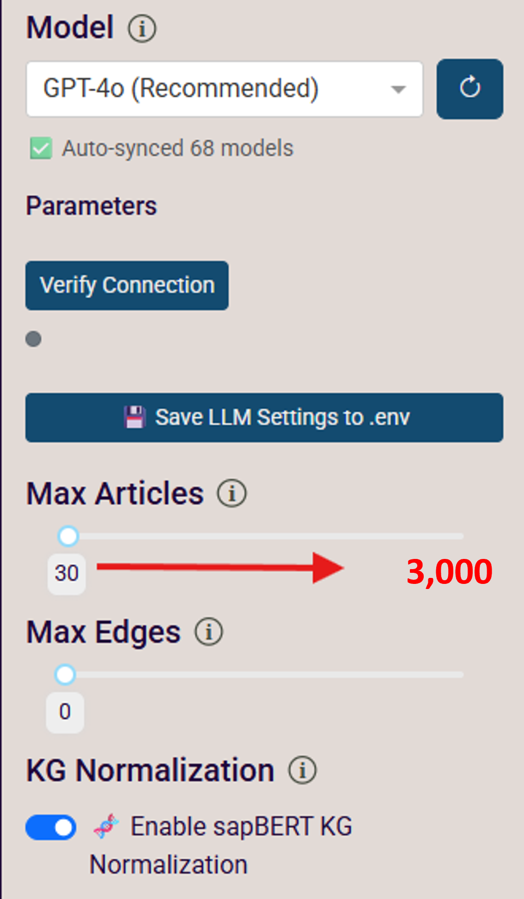
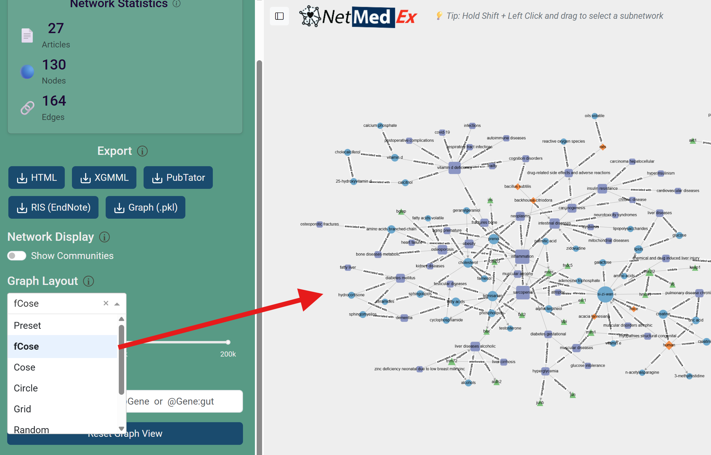
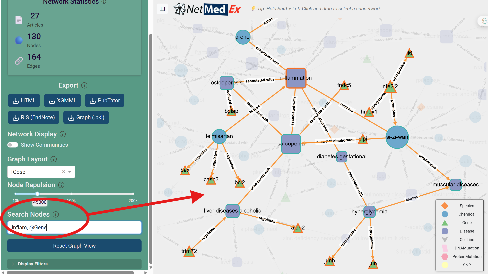
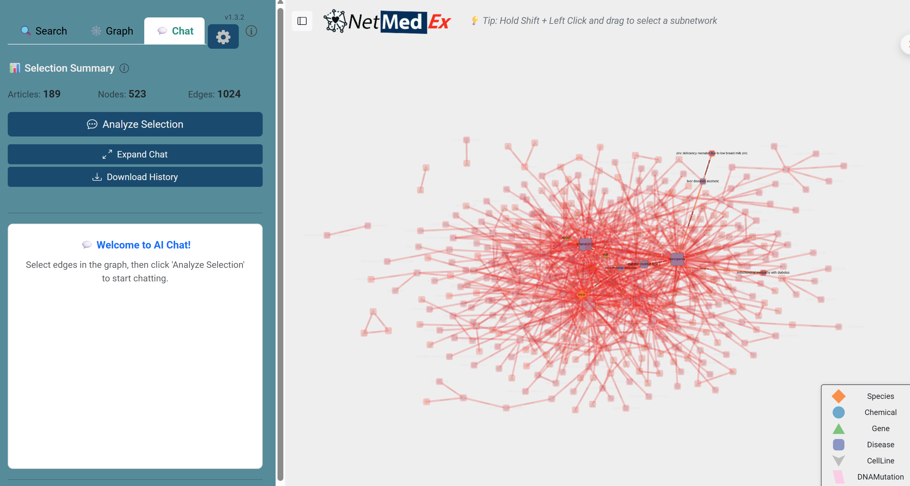
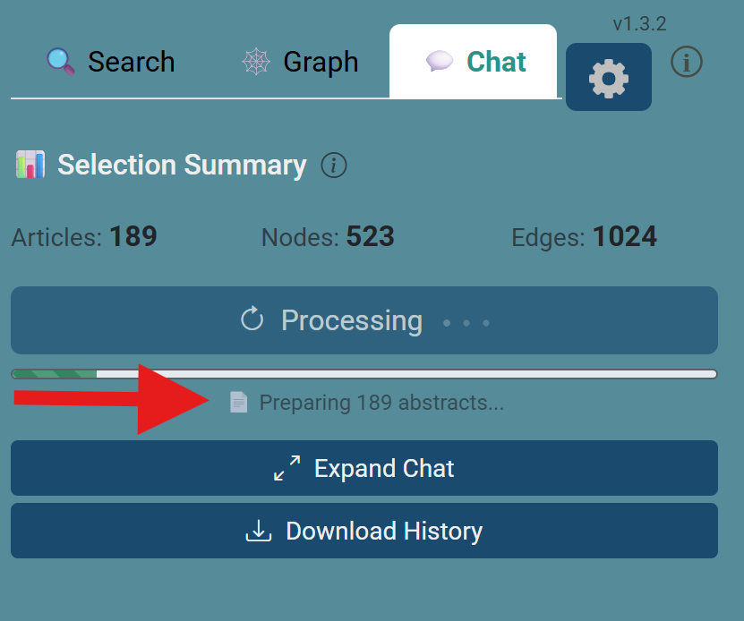
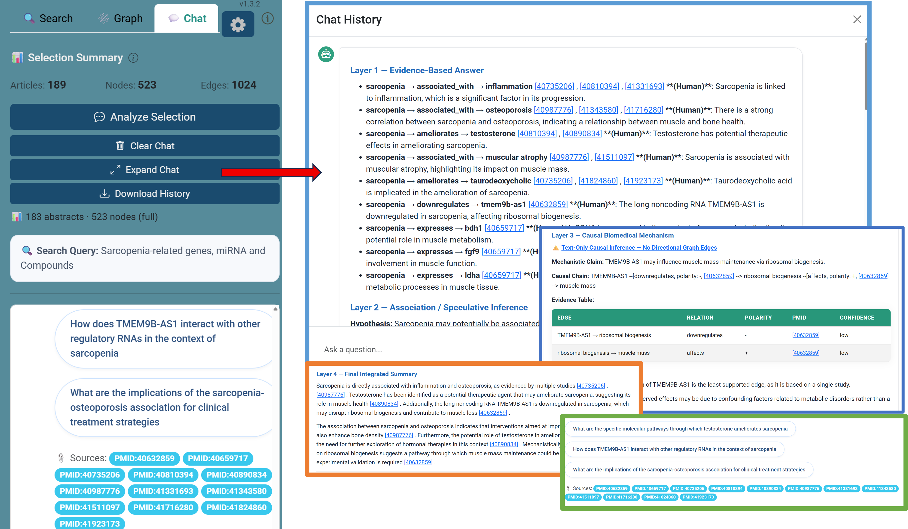

# NetMedEx v1.3.4

[](https://pypi.org/project/netmedex/)
[](https://github.com/lsbnb/NetMedEx)
[](https://yehzx.github.io/NetMedEx/)

**NetMedEx** is an AI-powered biomedical knowledge discovery platform. It searches over **30 million PubMed articles** via PubTator3, builds interactive co-mention networks of biological concepts (genes, diseases, chemicals, etc.), and lets you interrogate those networks through a **Hybrid RAG Chat** powered by large language models.

## What NetMedEx Can Do

NetMedEx follows a three-step discovery workflow — each step corresponds to a dedicated panel in the web interface:

1. **Search & Build Networks** — Query 30M+ PubMed articles by keyword, gene list, disease, or chemical. NetMedEx extracts co-mentioned biological entities and constructs a weighted, interactive knowledge graph. Supports multilingual input (CJK auto-translated to PubTator3 syntax).
2. **Explore the Graph** — Visualize entity relationships, detect communities (Louvain algorithm), adjust layout (fCose with node repulsion control), filter by entity type (`@Gene`, `@Disease`, …), and find the strongest-evidence path between nodes (Dijkstra weighted shortest path).
3. **Chat & Discover Mechanisms** — Select any sub-network and ask natural-language questions. The **5-Layer Hybrid RAG** uncovers latent 2-hop pathways (A → B → C) and structures responses from direct PMID-grounded evidence through speculative inference, causal mechanism, integrated summary, to suggested follow-up questions — with every claim labelled `[Human]` or `[Animal/In vitro]`.

**Supporting capabilities:**

- **Flexible LLM providers** — OpenAI, Anthropic Claude, Google Gemini, Groq, NVIDIA NIM, and local Ollama; configurable from the web UI without restarting.
- **Semantic entity normalization** — sapBERT + MeSH CUI deduplication merges abbreviations with full names (e.g. `"hcv"` ↔ `"hepatitis c virus"`) for a cleaner graph.
- **Rich export formats** — HTML (interactive), XGMML (Cytoscape), PubTator/BioC-JSON, RIS (EndNote), Chat History, and full Graph state (`.pkl`) for session restore.
- **Batch processing** — All search and network-building steps are also available via CLI for automated, high-throughput workflows.

---

<details>
<summary><h2>🆕 Recent Updates</h2></summary>

### v1.3.4 — 2026-06-22

- **Version Alignment**: Corrected remaining version strings in `README.md`, `DEPLOYMENT.md`, `DOCKERHUB_OVERVIEW.md`, and the sidebar UI to align with release `v1.3.4`.

### v1.3.3 — 2026-06-22

- **LLM Provider UI & Local Models**: Support for local model configuration and provider UI improvements with session isolation.
- **Offline Cache Support**: Pre-downloads tiktoken BPE cache in the builder stage to support air-gapped container environments.
- **Defensive Safeguards**: Normalization toggle is automatically disabled when no LLM is configured.
- **Config & Data Cleanups**: Redacted internal development variables, expanded `.env.example` to templates for all 7 providers, and excluded Pediatric CNS data from GitHub and Docker builds.

### v1.3.2 — 2026-06-01

- **Search Nodes @Type Syntax**: Type `@Gene`, `@Disease`, `@Gene:gut`, or `keyword, @Gene` in Search Nodes to highlight, filter, or path-search by biological entity type. Top-N anchor selection uses PMID literature count. Unmatched keywords are silently skipped.
- **Chat Download History Fix**: Download now exports the full unbounded message log, matching what the user sees in the UI chat panel.
- **Search Nodes Tooltip**: Improved info tooltip with @Type usage guide, anchor/path-node color legend, and silent-skip behaviour note.

### v1.3.1 — 2026-06-01

- **WAL Hang Fix**: Checkpoint diskcache SQLite WAL before each `initialize_chat()` run, preventing accumulated writes from blocking `set_progress()` and causing the Chat panel to appear permanently stuck.
- **Adaptive Chat Response Modes**: System prompt now selects response format based on question type — Compact Mode for simple factual queries, Layer 2 skip conditions to avoid empty structured blocks, and adaptive Layer 5 question count (3 for broad analyses, 1 for focused follow-ups, none for Compact Mode).

### v1.3.0 — 2026-05-30

- **Anthropic API Integration**: Full native support for Anthropic Claude models (e.g., `claude-3-5-sonnet`, `claude-3-opus`) as a core LLM provider in both the web application (Advanced Settings UI) and CLI/API interfaces.
- **Advanced LLM Settings & Customization**: Rewrote LLM initialization and configuration parsing (`llm.py` and `advanced_settings.py`) to support multi-provider environments, dynamic testing of connection status for Anthropic/OpenAI/Gemini/Groq/NVIDIA NIM, and direct environment configuration saving to `.env`.
- **CJK / Universal Translation Robustness**: Strict universal language requirements inside prompts for non-English users, enforcing CJK output generation for all headers, labels, and structured segments.
- **Token Usage & Cost Analysis**: Added complete documentation for cost calculation per pipeline stage (`docs/token_cost.md`), including strategies for cost minimization using lighter models or co-occurrence graphs.
- **Biomedical RAG Platform Comparisons**: Published comparative analysis documentation against MRTKG (`docs/NetMedEx_vs_MRTKG_comparison.md`) describing architectural advantages.

### v1.2.8 — 2026-05-25

- **Groq API Provider**: Dynamic model list fetching, connection testing, and server-side `.env` saving for Groq models (preset Llama 3.3, Llama 3.1, Mixtral, Gemma 2, and Custom).
- **Query Filtering**: Automatically appends publication-type exclusion tags (e.g., `NOT "Editorial"[pt]`) to free-text queries, filtering out non-research articles.
- **Suggested Questions**: Refined the format to use specific concepts from context rather than placeholders (X/Y), and expanded parser to handle bare `Q1:` formats.
- **Modal ID Suffixing**: Prevents ID conflicts when rendering chat components in Modal dialogs.
- **Test Suite Pass**: Restored all historical test data files and corrected LLM mock signatures to restore a 100% success rate (49/49 passed).

### v1.2.7 — 2026-05-21

- **Graph Lag Fix**: Server-side rebuild timing logs added; large graphs (>700 visible nodes) now use Cytoscape `preset` layout to skip a redundant client-side fCoSE pass after server-side layout.
- **Graph Loading Spinner**: A `dcc.Loading` overlay appears while the server-side graph rebuild callback runs, eliminating the blank-graph gap after Search completes.
- **NVIDIA NIM in All Callbacks**: Shared LLM initialisation helper ensures NVIDIA NIM is correctly wired into Search pipeline, auto-Chat, manual Chat, and session-rebuild paths (previously fell through to Local Ollama).
- **Non-English Search Gate**: Non-English queries now require an active LLM client to proceed; the final translated PubTator query is logged. Previously, CJK/Korean queries could reach PubTator untranslated when no LLM was configured.
- **PubTator Sort Consistency**: Page-1 search now passes the selected sort parameter, matching subsequent pages and eliminating duplicate/missing PMIDs across pagination.
- **PMID Deduplication**: PMIDs are deduplicated (order-preserving) before annotation fetch; a warning is emitted when parsed article count is significantly below `max_articles`.
- **Lazy Session Rebuild**: After a server restart, the Chat send-message callback reconstructs `ChatSession` from the persisted `G.pkl` instead of showing "session expired".
- **Chat Indexing Diagnostic**: Preflight log reports `selected_nodes`, `selected_edges`, `pmids`, and `abstracts_matched/total` before indexing. Indexing summary (`📊 N abstracts · M nodes (mode)`) displayed in status bar.
- **Semantic RE Timeout**: LLM timeout reduced 180 s → 90 s; per-article hard timeout of 300 s added; rate-limit retry progress reported in UI.
- **Node-Degree Debounce**: Number input fires graph rebuild only on Enter/blur, preventing per-keystroke rebuilds.

### v1.2.6 — 2026-05-15

- **5-Layer Evidence Reasoning Framework**: Chat responses are now structured into five layers — (1) Evidence-Based Answer with direct PMID citations per claim and `[Human]`/`[Animal/In vitro]` labelling; (2) Association / Speculative Inference with structured hypothesis blocks (graph path, per-edge PMIDs, path confidence, why speculative); (3) Causal Biomedical Mechanism with directional causal chain, polarity, evidence table, weakest link, and testable prediction (only when directional edges exist); (4) Final Integrated Summary with inline PMIDs; (5) Suggested Follow-up Questions.
- **Anti-Hallucination Core Principles**: 8 hard rules enforced at prompt level — never hallucinate PMIDs, never convert co-occurrence into regulation, edge-level citation required, strict layer separation, causal language (`inhibits`/`activates`/`drives`) restricted to Layer 3, speculative language mandate for Layers 2–3, species distinction mandatory, no external knowledge.
- **Per-message Language Detection**: Response language now follows each individual user message (English fallback for unrecognized scripts). Removes session-level language lock that forced non-English replies even for English questions.
- **Rolling History with Memory Compression**: Conversation history uses a sliding window (`max_history=3 pairs`). Aged-out turns are compressed into a structured memory buffer (stripped of tables, mermaid, layer headers, bold sub-labels) and re-injected as a system message each turn, preserving long-term context without token bloat.
- **Chat→Graph Highlighting**: 2-hop paths sync to Graph panel — bridge nodes glow gold, inferred edges render as dashed orange.
- **Dijkstra Shortest Path in Search Nodes**: Enter 2+ node names (comma-separated) to highlight the strongest-evidence path between them. Works in both the webapp and exported HTML.
- **CUI-based Node Deduplication**: Nodes sharing the same MeSH ID (e.g. `"hcv"` and `"hepatitis c virus"`) are now merged in the normalization step.
- **Search Nodes False-Positive Fix**: Segment-aware matching prevents short queries (e.g. `ID1`) from matching unrelated nodes (e.g. `COVID-19`).

### v1.2.4 — 2026-04-30

- **NVIDIA NIM Support**: Added NVIDIA NIM as a fifth LLM provider (alongside OpenAI, Google Gemini, OpenRouter, Local Ollama). Supports both cloud NIM (`integrate.api.nvidia.com`) and on-premises deployments with preset model catalogue and endpoint fetch.
- **Active LLM Banner**: Advanced Settings now displays the currently loaded server-side LLM provider and model on page load, eliminating ambiguity about which AI engine is active.
- **Collapsible UI Panels**: Search Panel reorganized into three zones — always-visible core fields, collapsible *Search Options* (Sort, PubTator Parameters), and collapsible *Advanced Network Options* (Node Filter, Edge Method, Weighting, Semantic Threshold). Graph tab gains a collapsible *Display Filters* section (Edge Confidence, Visible Node Types, Minimal Degree). Collapse states persist across sessions.
- **AI Search Simplified**: Replaced heavy Alert-box wrapper with a compact inline toggle row, reducing vertical space by ~40 px.
- **Chat Tab Accent**: Chat tab rendered in teal (`#0d9488`) when active for clearer panel differentiation.
- **HOST Environment Fix**: Resolved Conda build-triplet variable conflict that prevented `HOST=0.0.0.0` from loading via `.env`; `dotenv override=True` now uses an explicit absolute path.

### v1.2.3 — 2026-04-29

- **Collapsible Sidebar**: Toggle button collapses/expands the entire left sidebar; state persists via `localStorage`.
- **Search History**: Query history chips appear below the search box for one-click re-execution of recent queries (up to 8 entries, stored locally).

### v1.2.2 — 2026-04-28

- **Co-occurrence Edge Styling**: Dashed lines visually distinguish co-occurrence edges from solid semantic edges.
- **LLM Settings Persistence**: Advanced Settings values (provider, model selection) survive page reload via `localStorage`.
- **Save to .env**: Button to write LLM configuration back to the server `.env` file (requires `NETMEDEX_ALLOW_WEB_ENV_WRITE=true`).
- **Graph Empty State**: Friendly placeholder shown in the Graph Panel before any search is run.

### v1.2.1 — 2026-04-27

- Security hardening: HMAC-signed session tokens, path traversal prevention.
- Rate-limit retry with exponential back-off for PubTator3 API calls.
- Bug fixes: HTML export multi-node search, topological layout node overlap, CJK query translation pipeline.

</details>

---

## 🚀 Getting Started

| Method                                                   | Best for                           | Install                                                                              |
| -------------------------------------------------------- | ---------------------------------- | ------------------------------------------------------------------------------------ |
| [🐳 Docker](#-web-application-via-docker) *(Recommended)* | Quickest setup — no Python needed | `docker run`                                                                       |
| [💻 Local Install](#-web-application-local)                 | Web UI + development               | `git clone` + `pip install -e .`                                                 |
| [🛠️ CLI](#-command-line-interface-cli)                    | Batch processing & automation      | `pip install git+https://github.com/lsbnb/NetMedEx.git` *(no repo clone needed)* |

---

## 🐳 Web Application (via Docker)

The easiest way to start. No Python installation required.

```bash
docker run -d -p 8050:8050 --rm lsbnb/netmedex
```

> [!IMPORTANT]
> Open **[http://localhost:8050](http://localhost:8050)** in your browser.

---

## 💻 Web Application (Local)

Requires **Python ≥ 3.11**.

> [!WARNING]
> The PyPI release (`pip install netmedex`) is outdated (≤ v0.3.0). Use the steps below to get the latest version.

### 1. Clone and install

```bash
git clone https://github.com/lsbnb/NetMedEx.git
cd NetMedEx

python3 -m venv .venv
source .venv/bin/activate        # Windows: .venv\Scripts\activate

pip install -e .
```

### 2. Start the webapp

**Linux / macOS:**

```bash
pip install gunicorn
bash start_webapp.sh
```

**Windows:**

`start_webapp.sh` requires bash and gunicorn, which are not natively supported on Windows. Choose one of the following:

- **Recommended — WSL (Windows Subsystem for Linux):** Install [WSL 2](https://learn.microsoft.com/windows/wsl/install), then follow the Linux steps above inside the WSL terminal.
- **Alternative — `waitress` (runs natively on Windows):**

  ```powershell
  pip install waitress
  $env:NETMEDEX_SESSION_SECRET = python -c "import secrets; print(secrets.token_hex(32))"
  waitress-serve --host=0.0.0.0 --port=8050 webapp.wsgi:application
  ```

> [!NOTE]
> If you encounter encoding errors with non-ASCII content (e.g. Chinese terms) on Windows, ensure your terminal is set to UTF-8: `chcp 65001`.

Open **[http://localhost:8050](http://localhost:8050)** in your browser.

> [!TIP]
> No API key is needed to start. Once the app is running, go to **Advanced Settings** in the sidebar to enter your LLM provider key (OpenAI, Anthropic, Gemini, Groq, etc.). You can also save it permanently to `.env` from within the UI.

---

## 🤖 Hybrid RAG-Powered Discovery

NetMedEx features an interactive **Chat Panel** driven by **Hybrid RAG**, which combines the power of large language models (LLMs) with specialized bio-medical knowledge graphs.

<p align="center">
  
  <br>
  <i>Figure 1: NetMedEx Hybrid RAG Architecture combining Text and Graph RAG for chatting with biomedical knowledge.</i>
</p>

### Key Capabilities

- **Full-Text BioC-JSON Ingestion**: Retrieve and analyze the entire article (Methods, Results, Discussion) via PubTator3 API integration.
- **PMID-Based De-duplication**: Automatically consolidates multiple mentions of entities and relations within the same paper to ensure accurate NPMI calculation and knowledge graph stability.
- **Hybrid RAG Chat**: Synthesizes **unstructured text** (abstracts + full-text) and **structured graph knowledge** (paths and neighbors).
- **🧠 Smart 2-Hop Graph RAG**: Deep mechanistic discovery using two-hop traversal with hybrid scoring (NPMI + Confidence + Semantic Relevance).
- **🔬 2-Hop Mechanistic Path Reports** *(v1.2.6)*: When 2-hop paths (A → B → C) are identified, the chat response describes each path in Layer 2 (Speculative Inference) and Layer 3 (Causal Mechanism) — including the graph path, per-edge PMID citations, path confidence score, and directionality. The corresponding bridge nodes and path edges are simultaneously highlighted in the Graph Panel.
- **🔗 Chat→Graph Synchronization** *(v1.2.6)*: 2-hop inference paths automatically highlight back in the Graph Panel — bridge nodes glow gold, inferred path edges render as dashed orange.
- **🛤️ Dijkstra Weighted Shortest Path** *(v1.2.6)*: Enter 2+ node names (comma-separated) in **Search Nodes** to find the strongest-evidence route between them, weighted by NPMI. Available in both the webapp and exported HTML.
- **🧬 sapBERT + CUI-based KG Normalization** *(v1.2.6)*: Two-pass normalization — MeSH CUI-based deduplication (merges abbreviations with their full names, e.g., `"hcv"` → `"hepatitis c virus"`) followed by sapBERT embedding similarity.
- **⚖️ Study-Type Labeling**: Automated distinction between Human clinical data and Animal/Cell-line models.
- **Relation Directionality**: High-resolution arrows indicate the direction of semantic influence (e.g., A → activates → B).
- **Edge Confidence Coloring**: Edges are color-coded (gradient heatmap) based on AI-extracted confidence scores.
- **Dynamic Node Repulsion**: Real-time control of node spacing using the **fCose layout** slider.
- **ChatGPT-Style Chat Experience**: Features an intuitive Chat Panel with **Smart Provenance Links**, **Native Markdown Tables**, and **Suggested Questions**.
- **Natural Language & Universal Translation**: Ask in English, Japanese, Chinese, or Korean! Automatic translation to optimized PubTator3 English syntax.

### Setup AI Engine

1. Obtain an API key from your preferred provider or set up a local/on-premises LLM endpoint.
2. Configure via **"Advanced Settings"** in the web interface or via `.env` file.

Supported LLM providers:

| Provider                | Where to get key                                         | Notes                                    |
| ----------------------- | -------------------------------------------------------- | ---------------------------------------- |
| **OpenAI**        | [platform.openai.com](https://platform.openai.com/api-keys) | Recommended:`gpt-4o`                   |
| **Google Gemini** | [aistudio.google.com](https://aistudio.google.com)          | Recommended:`gemini-2.0-flash`         |
| **OpenRouter**    | [openrouter.ai](https://openrouter.ai/keys)                 | Access 200+ models via single key        |
| **NVIDIA NIM**    | [build.nvidia.com](https://build.nvidia.com)                | Cloud or on-premises NIM (`nvapi-...`) |
| **Local Ollama**  | —                                                       | Self-hosted, no key required             |

> [!TIP]
> **Connecting to Local / On-premises LLMs:**
>
> - **Linux/Docker**: Use your host IP (e.g., `http://192.168.1.100:11434`).
> - **Windows/macOS (Docker)**: Use `http://host.docker.internal:[PORT]`.
> - **NVIDIA NIM (cloud)**: Base URL `https://integrate.api.nvidia.com/v1`, key starts with `nvapi-`.
> - **NVIDIA NIM (on-prem)**: Set Base URL to your internal NIM server, use any non-empty key value.

---

## 🖼️ Interface & Quick Tour

The workspace follows a logical discovery workflow across three main operational panels.

### 1. Search & Configuration (The Entry Point)

The **Search Panel** is where you define your research scope and configure the AI engine.

<p align="center">
  
  <br>
  <i>Figure 2: The Search Panel for keyword and natural language querying.</i>
</p>

Click the ⚙️ gear icon in the sidebar to open **Advanced Settings** and configure your LLM provider. This is a crucial first step for enabling semantic analysis.

<p align="center">
  
  <br>
  <i>Figure 3: Configuring the AI Engine (OpenAI or Local) in Advanced Settings.</i>
</p>

<p align="center">
  
  <br>
  <i>Figure 4: Selecting a specific model for local AI processing via the dropdown menu.</i>
</p>

Beyond the LLM provider selection, **Advanced Settings** also controls search scale and graph quality. The **Max Articles** slider can be raised up to 3,000 for comprehensive literature coverage, while **KG Normalization** (sapBERT + MeSH CUI) consolidates entity synonyms — merging abbreviations such as `"hcv"` ↔ `"hepatitis c virus"` — for a cleaner, deduplicated graph.

<p align="center">
  
  <br>
  <i>Figure 5: Advanced Settings — Max Articles scaled to 3,000 for large-scale literature mining. KG Normalization (sapBERT + MeSH CUI) merges entity synonyms; Max Edges limits co-mention edges per article to control graph density.</i>
</p>

NetMedEx also exposes a **FastAPI Bridge** (`netmedex_fastapi_server.py`) that wraps the full Search → Network → Chat pipeline as REST endpoints, allowing external applications to integrate biomedical literature discovery without embedding the full stack.

<p align="center">
  
  <br>
  <i>Figure 6: NetMedEx FastAPI Bridge — `POST /sessions` builds the search-to-network-to-chat pipeline from a gene list and returns a session ID; `POST /sessions/{session_id}/ask` performs multi-turn Hybrid RAG queries against the indexed graph. The bridge supports all six LLM providers and both co-occurrence and semantic edge methods.</i>
</p>

Users can also upload previously downloaded PubTator format files for re-analysis, or restore a previously exported **Graph File** (`.pkl`) to skip re-processing entirely.

<p align="center">
  
  <br>
  <i>Figure 7: Uploading PubTator files for re-analysis, or a Graph File (.pkl) to instantly restore a saved session.</i>
</p>

> [!TIP]
> **Graph File Restore**: After a time-consuming Semantic Analysis run, export the result as a **Graph (.pkl)** from the Graph Panel, then reload it later via **Search Panel → Source: Graph File (.pkl)**. The full graph state — including all semantic edges, node metadata, and article abstracts — is restored instantly, allowing you to continue adjusting the network and using the Chat Panel without re-running any analysis.

### 2. Graph & Scaffolding (Structural View)

The **Graph Panel** visualizes the co-mention or semantically analyzed network. Users can explore entity relationships using different layouts and community detection algorithms, then select a sub-network as the context for AI-powered chat in the next step.

<p align="center">
  
  <br>
  <i>Figure 8: Case study: A disease-gene-chemical co-mention network visualized in NetMedEx, showing semantic-level relationships between genes, diseases, chemicals, and species.</i>
</p>

The sidebar shows **Network Statistics** for the visible graph:

- 📄 **Articles** — unique PubMed articles linked to at least one edge. May be lower than the Chat panel count, which also includes isolated nodes without edges.
- 🔵 **Nodes** — number of biological entity nodes currently displayed.
- 🔗 **Edges** — number of co-occurrence or semantic relationship edges.

Each network element carries structured information:

- **Nodes**: Genes, Diseases, Chemicals, and Species.
- **Edges**: Literature co-occurrence or semantic relations. Thicker edges indicate higher frequency/NPMI; **arrows** indicate directionality in semantic mode.
- **Confidence Heatmap**: Edge colors transition from cool to warm based on the extracted confidence score.
- **fCose Node Repulsion**: Use the slider in Graph Settings to adjust network spacing dynamically (10k–100k units).
- **Clusters**: Use **Community Detection** to group related concepts automatically using the Louvain method.

<p align="center">
  
  <br>
  <i>Figure 9: The fCose force-directed layout with node repulsion control, providing dynamic spacing adjustment for optimal network readability.</i>
</p>

<p align="center">
  
  <br>
  <i>Figure 10: Automated community detection for functional clustering using the Louvain algorithm.</i>
</p>

> [!TIP]
> **Search Nodes — Shortest Path** *(v1.2.6)*: Type two or more node names separated by commas in the **Search Nodes** field (e.g., `Piezo1, neoplasms`) to compute the **Dijkstra weighted shortest path** between them. The strongest-evidence route is highlighted: anchor nodes in orange, bridge nodes in teal, and path edges as thicker orange lines. If no path exists, the panel falls back to standard neighbor highlighting. The same feature is available in exported HTML files.

<p align="center">
  
  <br>
  <i>Figure 11: Dijkstra weighted shortest-path result in Search Nodes — anchor nodes highlighted in orange, bridge nodes in teal, path edges rendered as thicker orange lines against a dimmed background.</i>
</p>

Hold **Shift** and click to select nodes and edges, isolating a sub-network as the context for Hybrid RAG chat in the next step.

<p align="center">
  
  <br>
  <i>Figure 12: Selecting a sub-network by holding the Shift key to isolate relevant nodes and edges as the base for Hybrid RAG to chat with.</i>
</p>

The network can be exported in several formats:

| Export Format                  | Description                                                                                                                                                  | Re-importable?                             |
| ------------------------------ | ------------------------------------------------------------------------------------------------------------------------------------------------------------ | ------------------------------------------ |
| **HTML**                 | Interactive visualization for browsers ([example](https://htmlpreview.github.io/?https://github.com/lsbnb/NetMedEx/blob/main/docs/demo_html.html))              | ❌                                         |
| **XGMML**                | Network file for Cytoscape Desktop ([example](docs/demo.xgmml))                                                                                                 | ❌                                         |
| **PubTator / BioC-JSON** | Raw annotation file ([example](docs/demo_pubtator.biocjson))                                                                                                    | ✅ Re-upload in Search Panel               |
| **RIS (EndNote)**        | Full bibliographic metadata for citation management ([example](docs/ENDNOTE_citations.ris))                                                                     | ❌                                         |
| **Chat History**         | Full chat session as a standalone HTML file ([example](https://htmlpreview.github.io/?https://github.com/lsbnb/NetMedEx/blob/main/docs/demo_chat_history.html)) | ❌                                         |
| **Graph (.pkl)**         | **Full graph state** including semantic analysis results and article abstracts                                                                         | ✅ Restore in Search Panel → "Graph File" |

> [!NOTE]
> **Cytoscape XGMML Export**: The topological graph structure, relation edge data, and structural directionality translate natively to Cytoscape Desktop for third-party graph analysis without information loss.

### 3. Chat & Semantic Insights (Interpretation)

The **Chat Panel** lets you interrogate the selected sub-network in natural language, powered by Hybrid RAG combining graph structure and article abstracts.

**Step 1 — Start the analysis.** After selecting nodes and edges in the Graph Panel, press **"Analyze Selection"** to index the sub-network. The status bar shows the number of articles and nodes being indexed.

<p align="center">
  
  <br>
  <i>Figure 13: Select nodes/edges in the Graph Panel, then press "Analyze Selection" — the Selection Summary shows the articles, nodes, and edges to be indexed.</i>
</p>

<p align="center">
  
  <br>
  <i>Figure 14: Indexing diagnostics in the status bar — showing abstract count, indexed node count, and indexing mode.</i>
</p>

**Step 2 — Ask questions.** Type any natural-language question about the sub-network. Responses follow the **5-Layer Evidence Reasoning Framework**:

- **Layer 1**: Direct evidence — per-claim PMID citations, `[Human]` / `[Animal/In vitro]` labels
- **Layer 2**: Speculative inference — 2-hop paths (A → B → C) with per-edge PMIDs and path confidence
- **Layer 3**: Causal mechanism — directional chain, polarity, weakest-link evidence, testable prediction
- **Layer 4**: Integrated summary with inline PMIDs
- **Layer 5**: Suggested follow-up questions

<p align="center">
  
  <br>
  <i>Figure 15: Hybrid RAG Chat Panel showing a 5-Layer Evidence Reasoning Framework response with inline PMID citations.</i>
</p>

**Chat→Graph Synchronization** *(v1.2.6)*: When 2-hop paths are identified in a response, the Graph Panel updates automatically — bridge nodes glow gold, endpoint nodes turn blue, and inferred path edges appear as dashed orange lines. Highlights clear when a new **Search Nodes** query is activated.

**Chat History**: All sessions are preserved in the **Chat History** panel (accessible via the **Expand Chat** button). Use the **Download History** button to export the full session as a self-contained HTML file — all 5-Layer responses, inline PMID citations, and Markdown tables are preserved with formatting intact. See a [live demo](https://htmlpreview.github.io/?https://github.com/lsbnb/NetMedEx/blob/main/docs/demo_chat_history.html).

<p align="center">
  
  <br>
  <i>Figure 16: The 5-Layer Evidence Reasoning Framework structure.</i>
</p>

> [!TIP]
> Ask for results as a **Markdown table** — the Chat Panel renders them inline, and they are preserved in the HTML history export.

<p align="center">
  
  <br>
  <i>Figure 17: Semantic analysis results rendered as a Markdown table (e.g., miRNA relationships).</i>
</p>

## ⚙️ Batch Processing vs. Interactive Discovery

While the **Web Interface** provides a full "Interactive Discovery" workflow—including dynamic sub-network selection (Shift+Select) and real-time Hybrid RAG chat—the **CLI** and **API** are designed for automated batch processing and static graph construction.

- **Interactive Discovery (Web Only)**: Real-time interaction, dynamic graph filtering, and context-aware chat.
- **Batch Processing (CLI/API)**: Static semantic analysis and high-throughput network generation.

---

<details>
<summary><h2>🛠️ Command-Line Interface (CLI)</h2></summary>

#### Step 1: Search PubMed

```bash
# Search articles by keywords
netmedex search -q '"N-dimethylnitrosamine" AND "Metformin"' --sort score
```

`netmedex search` key options:

- `-q, --query`: Query string.
- `-p, --pmids`: Comma-separated PMID list (alternative to `--query`).
- `-f, --pmid_file`: Load PMIDs from file, one per line (alternative to `--query`).
- `-o, --output`: Output `.pubtator` path.
- `-s, --sort {score,date}`: Sort by relevance (`score`) or newest (`date`, default).
- `--max_articles`: Maximum number of articles to request (default: `1000`).
- `--full_text`: Collect full-text annotations when available.
- `--use_mesh`: Use MeSH vocabulary in output.
- `--ai_search`: Enable LLM-based natural language to PubTator boolean query translation.
- `--llm_provider {openai,google,openrouter,nvidia,local}`: Provider for AI search translation.
- `--llm_api_key`: API key override for selected provider.
- `--llm_model`: Model override for selected provider.
- `--llm_base_url`: Base URL override (primarily for local/OpenAI-compatible endpoints).

Optional: enable AI query translation (`--ai_search`) with the same three providers.

```bash
# OpenAI
netmedex search \
  -q "Find papers about metformin effects in NASH" \
  --ai_search \
  --llm_provider openai \
  --llm_api_key "$OPENAI_API_KEY" \
  --llm_model "gpt-4o-mini"
```

```bash
# Google / Gemini
netmedex search \
  -q "Find papers about metformin effects in NASH" \
  --ai_search \
  --llm_provider google \
  --llm_api_key "$GEMINI_API_KEY" \
  --llm_model "gemini-2.0-flash"
```

```bash
# Local (Ollama / LocalAI / LM Studio OpenAI-compatible endpoint)
netmedex search \
  -q "Find papers about metformin effects in NASH" \
  --ai_search \
  --llm_provider local \
  --llm_base_url "http://localhost:11434/v1" \
  --llm_model "llama3.1"
```

#### Step 2: Build the Network

```bash
# Generate HTML network for browser viewing
netmedex network -i annotations.pubtator -o network.html -w 2 --community

# Generate pickle graph for CLI chat (required for `netmedex chat`)
netmedex network -i annotations.pubtator -o network.pickle -f pickle
```

> [!IMPORTANT]
> The default output format is **HTML**. To use the graph with `netmedex chat`, you **must** specify `-f pickle` explicitly.
> Simply naming the output file `.pkl` is not enough — without `-f pickle`, it will still be written as HTML and `chat` will fail with `invalid load key`.

#### Step 3 (Optional): Semantic Edge Extraction with LLM Providers

Use `--edge_method semantic` to enable semantic relationship extraction.

```bash
# OpenAI
netmedex network \
  -i annotations.pubtator \
  -o semantic_openai.html \
  --edge_method semantic \
  --llm_provider openai \
  --llm_api_key "$OPENAI_API_KEY" \
  --llm_model "gpt-4o-mini"
```

```bash
# Google / Gemini
netmedex network \
  -i annotations.pubtator \
  -o semantic_google.html \
  --edge_method semantic \
  --llm_provider google \
  --llm_api_key "$GEMINI_API_KEY" \
  --llm_model "gemini-2.0-flash"
```

```bash
# Local (Ollama / LocalAI / LM Studio OpenAI-compatible endpoint)
netmedex network \
  -i annotations.pubtator \
  -o semantic_local.html \
  --edge_method semantic \
  --llm_provider local \
  --llm_base_url "http://localhost:11434/v1" \
  --llm_model "llama3.1"
```

You can also omit `--llm_*` flags and configure defaults via `.env` (e.g., `LLM_PROVIDER`, `OPENAI_API_KEY`, `GEMINI_API_KEY`, `LOCAL_LLM_BASE_URL`, `OPENAI_MODEL`, `GOOGLE_MODEL`, `LOCAL_LLM_MODEL`).

Provider consistency note:

- CLI supports five providers (`openai`, `google`, `openrouter`, `nvidia`, `local`) across `search`, `network`, and `chat`.
- Provider settings are passed by CLI flags or `.env` values; they are not serialized into `.pubtator`/graph outputs automatically.

#### Step 4 (Optional): Hybrid RAG CLI Chat (Search → Network → Chat)

`netmedex chat` uses the pickled graph (`-f pickle`) as Hybrid RAG context and supports the same three providers.

> [!NOTE]
> **First run (pip install only)**: `netmedex chat` uses ChromaDB with the `all-MiniLM-L6-v2` embedding model (~79 MB). This model is downloaded automatically on first use and cached locally — subsequent runs do not require a download. Ensure internet access is available for the initial run.
> The **Docker image** already bundles this model — no download needed.

```bash
# One-shot question
netmedex chat \
  -g network.pickle \
  -q "Summarize key evidence and hypotheses for metformin in NASH." \
  --llm_provider openai \
  --llm_api_key "$OPENAI_API_KEY"
```

```bash
# Interactive mode
netmedex chat \
  -g network.pickle \
  --llm_provider local \
  --llm_base_url "http://localhost:11434/v1" \
  --llm_model "llama3.1"
```

Tips:

- Type `exit` or `quit` to leave interactive mode.
- Use `/clear` to clear chat history.
- Use `/stats` to inspect session statistics.

</details>

---

<details>
<summary><h2>🐍 Package API</h2></summary>

NetMedEx exposes two programmatic interfaces for embedding into Python pipelines or external UIs.

### Embed NetMedEx in Your Own Chat App

If your upstream pipeline finds candidate genes (e.g., top 5 DE genes), you can directly bridge into NetMedEx and keep a conversational session in your own UI.

See example:

- `examples/netmedex_chat_bridge.py`

Minimal flow:

```python
from netmedex.chat_bridge import BridgeConfig, NetMedExChatBridge

cfg = BridgeConfig(provider="google", model="gemini-2.0-flash", edge_method="semantic")
bridge = NetMedExChatBridge(cfg)

bridge.build_context_from_genes(
    genes=["SOST", "LRP5", "TNFRSF11B", "RUNX2", "ALPL"],
    disease="osteoporosis",
)
answer = bridge.ask("What are the strongest evidence links and possible mechanisms?")
print(answer["message"])
```

### FastAPI Bridge (for external chat UIs)

Install API extras and run:

```bash
pip install -e ".[api]"
python examples/netmedex_fastapi_server.py
```

Endpoints:

- `GET /health`: service health check.
- `POST /sessions`: build Search -> Network -> Chat context and create a chat session.
- `POST /sessions/{session_id}/ask`: send a question in that session.
- `DELETE /sessions/{session_id}`: release session state.

Create a session from genes:

```bash
curl -X POST "http://127.0.0.1:8000/sessions" \
  -H "Content-Type: application/json" \
  -d '{
    "config": {
      "provider": "google",
      "model": "gemini-2.0-flash",
      "edge_method": "semantic",
      "max_articles": 120
    },
    "genes": ["SOST", "LRP5", "TNFRSF11B", "RUNX2", "ALPL"],
    "disease": "osteoporosis"
  }'
```

Ask in-session:

```bash
curl -X POST "http://127.0.0.1:8000/sessions/<SESSION_ID>/ask" \
  -H "Content-Type: application/json" \
  -d '{"question":"Summarize strongest evidence and potential mechanisms."}'
```

Framework-agnostic Python client example:

```python
from examples.netmedex_fastapi_client import NetMedExAPIClient

client = NetMedExAPIClient("http://127.0.0.1:8000")
client.create_session(
    config={
        "provider": "google",
        "model": "gemini-2.0-flash",
        "edge_method": "semantic",
        "max_articles": 120,
    },
    genes=["SOST", "LRP5", "TNFRSF11B", "RUNX2", "ALPL"],
    disease="osteoporosis",
)
resp = client.ask("Summarize strongest evidence and potential mechanisms.")
print(resp["message"])
client.close()
```

Reference client file:

- `examples/netmedex_fastapi_client.py`

Integration examples for your own app/chat platform:

```python
# Example A: wrap NetMedEx into your backend service function
from examples.netmedex_fastapi_client import NetMedExAPIClient

def run_gene_chat(genes: list[str], user_question: str) -> str:
    client = NetMedExAPIClient("http://127.0.0.1:8000")
    client.create_session(
        config={
            "provider": "google",
            "model": "gemini-2.0-flash",
            "edge_method": "semantic",
            "max_articles": 120,
        },
        genes=genes,
        disease="osteoporosis",
    )
    try:
        resp = client.ask(user_question)
        return resp.get("message", "")
    finally:
        client.close()
```

```javascript
// Example B: call NetMedEx API from any web frontend (React/Vue/plain JS)
async function askNetMedEx(baseUrl, sessionId, question) {
  const resp = await fetch(`${baseUrl}/sessions/${sessionId}/ask`, {
    method: "POST",
    headers: { "Content-Type": "application/json" },
    body: JSON.stringify({ question })
  });
  if (!resp.ok) throw new Error(await resp.text());
  return await resp.json(); // { success, message, sources, ... }
}
```

```text
Example C: recommended lifecycle for multi-turn chat
1) User selects genes/disease in your app.
2) Backend calls POST /sessions once and stores session_id.
3) Each user message calls POST /sessions/{session_id}/ask.
4) On chat end/timeout, call DELETE /sessions/{session_id}.
```

Minimal Web Chat UI (no framework):

```bash
# terminal 1: start FastAPI bridge
python examples/netmedex_fastapi_server.py

# terminal 2: serve static examples folder
python -m http.server 8080 --directory examples
```

Then open:

- `http://127.0.0.1:8080/minimal_chat_ui.html`

Gradio Chat UI:

```bash
# terminal 1: start FastAPI bridge
python examples/netmedex_fastapi_server.py

# terminal 2: launch gradio app
pip install -e ".[ui]"
python examples/gradio_chat_ui.py
```

Then open:

- `http://127.0.0.1:7860`
- In the UI, click `Create Session` first, then ask questions.

</details>

---

## 🛠️ Contribution & Development

NetMedEx is an open-source research initiative. We welcome contributions to our semantic extraction pipeline and UI visualization modules.

© 2026 NetMedEx Team. Prepared for submission to GitHub under **cylin2022**.

---

© 2026 LSBNB Lab@ IIS, Academia Sinica, TAIWAN. Refer to [LICENSE](LICENSE) for details.
