# NetMedEx

[](https://pypi.org/project/netmedex/)
[](https://yehzx.github.io/NetMedEx/)  

NetMedEx is an AI-powered knowledge discovery platform designed to transform biomedical literature into actionable insights. Unlike traditional tools that merely extract entities, NetMedEx leverages **Hybrid Retrieval-Augmented Generation (Hybrid RAG)** to synthesize structured co-mention networks with unstructured text, providing a holistic understanding of biological relationships.

## 🌟 Core Philosophy: Scaffolding for Discovery

In NetMedEx, the **Co-Mention Network** serves as a structural "scaffolding." While the network visualizes the landscape of bio-concepts (genes, diseases, chemicals, etc.), the **AI-driven Semantic Layer** breathes life into these connections by extracting evidence, identifying relationship types, and answering complex natural language queries.

---

## 🚀 Getting Started

NetMedEx offers flexible ways to interact with the platform:

1. [Web Application (via Docker)](#-web-application-via-docker) - **Recommended**
2. [Web Application (Local)](#-web-application-local)
3. [Command-Line Interface (CLI)](#-command-line-interface-cli)
4. [Python API](#-package-api)

---

## 🐳 Web Application (via Docker)

The easiest way to start is using [Docker](https://www.docker.com/). Run the command below and visit the access URL:

```bash
docker run -d -p 8050:8050 --rm lsbnb/netmedex
```

> [!IMPORTANT]
> **Access URL**: [http://localhost:8050](http://localhost:8050)


## 📦 Installation

Alternatively, install via PyPI for local hosting or CLI access:

```bash
pip install netmedex
```
*Recommended: Python >= 3.11*

## 💻 Web Application (Local)

Launch the interactive dashboard locally:

```bash
netmedex run
```

---

## 🤖 Hybrid RAG-Powered Discovery

NetMedEx features an interactive **Chat Panel** driven by **Hybrid RAG**, which combines the power of large language models (LLMs) with specialized bio-medical knowledge graphs.

<p align="center">
  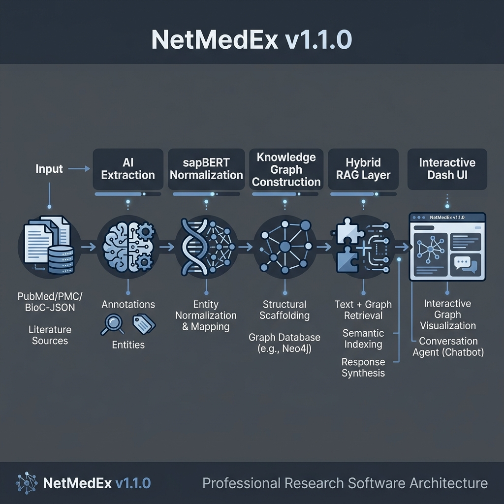
  <br>
  <i>Figure 1: NetMedEx Hybrid RAG Architecture combining Text and Graph RAG for chatting with biomedical knowledge.</i>
</p>

### Key Capabilities
- **Hybrid RAG Chat**: Synthesizes **unstructured text** (abstracts) and **structured graph knowledge** (paths and neighbors).
- **Natural Language & Universal Translation**: Ask in English, Japanese, Chinese, or Korean! NetMedEx automatically translates non-English queries to optimized standard PubTator3 English syntax before searching.
- **ChatGPT-Style Chat Experience**: Features an intuitive, auto-scrolling Chat Panel that perfectly mimics modern AI layouts (user queries on the right, AI responses on the left), preventing the need for manual scrolling.
- **Semantic Evidence Extraction**: Automatically identifies relationship types (e.g., *treats*, *inhibits*) and **confidence scores**.
- **Evidence Confidence Scoring**: The AI evaluates its own extraction certainty (0.0 to 1.0) based on the textual strength of the abstract. Users can adjust a **Semantic Confidence Threshold** to filter for strict clinical evidence (>0.7) or exploratory novel associations (<0.3).
- **Contextual Reasoning**: Identifies shortest paths and relevant subgraphs to explain hidden connections between entities.

### Setup AI Engine
1. Obtain an API key from [OpenAI](https://platform.openai.com/api-keys) or set up a local LLM endpoint (e.g., Ollama).
2. Configure via **"Advanced Settings"** in the web interface or via `.env` file.

> [!TIP]
> **Connecting to Local LLMs (Ollama/LM Studio):**
> - **Linux/Docker**: Use your host IP (e.g., `http://192.168.1.100:11434`).
> - **Windows/macOS (Docker)**: Use `http://host.docker.internal:[PORT]`.

---

## 🖼️ Interface & Quick Tour

The workspace follows a logical discovery workflow across three main operational panels.

### 1. Search & Configuration (The Entry Point)
The **Search Panel** is where you define your research scope and configure the AI engine.

<p align="center">
  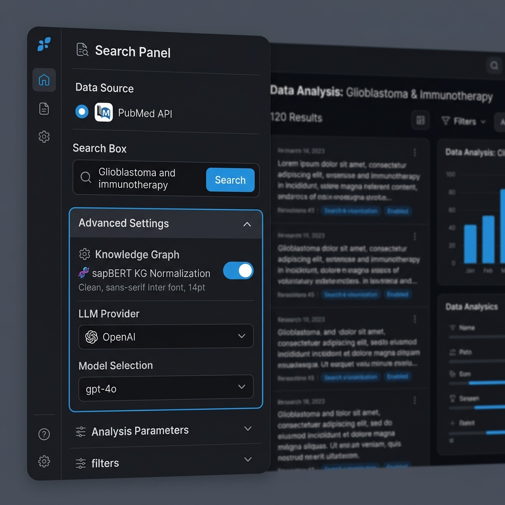
  <br>
  <i>Figure 2: The Search Panel for keyword and natural language querying.</i>
</p>

Expand **Advanced Settings** to configure your LLM provider. This is a crucial first step for enabling semantic analysis.

<p align="center">
  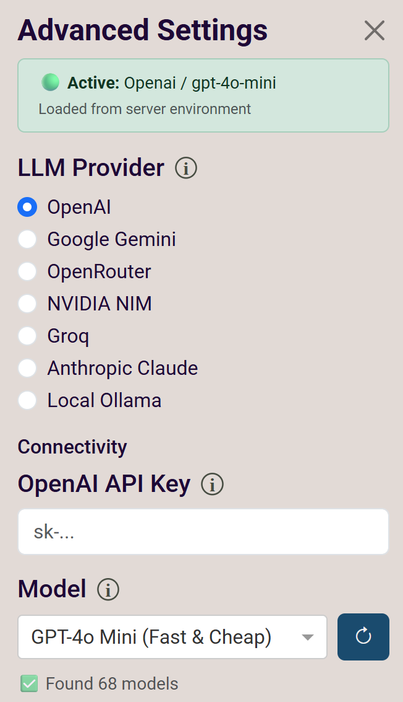
  <br>
  <i>Figure 3: Configuring the AI Engine (OpenAI or Local) in Advanced Settings.</i>
</p>

<p align="center">
  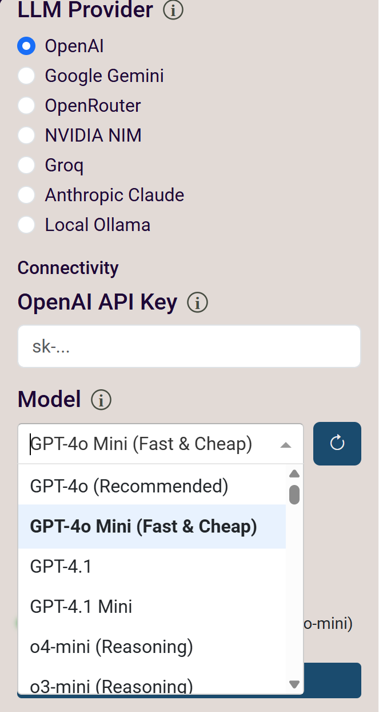
  <br>
  <i>Figure 4: Selecting a specific model for local AI processing via the dropdown menu.</i>
</p>

Users can also upload previously downloaded PubTator format files for re-analysis, or restore a previously exported **Graph File** (`.pkl`) to skip re-processing entirely.

<p align="center">
  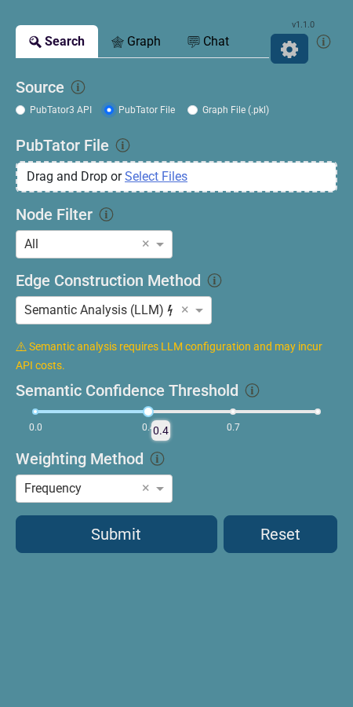
  <br>
  <i>Figure 5: Uploading PubTator files for re-analysis, or a Graph File (.pkl) to instantly restore a saved session.</i>
</p>

> [!TIP]
> **Graph File Restore**: After a time-consuming Semantic Analysis run, export the result as a **Graph (.pkl)** from the Graph Panel, then reload it later via **Search Panel → Source: Graph File (.pkl)**. The full graph state — including all semantic edges, node metadata, and article abstracts — is restored instantly, allowing you to continue adjusting the network and using the Chat Panel without re-running any analysis.

### 2. Graph & Scaffolding (Structural View)
The **Graph Panel** visualizes the co-mention/semantic analyzed network, providing the visualization of search results for your research. Using the shift key to select sub-network, those selected nodes and edges will be highlighted as the base for chat in next step. Users can visualize the network using different layouts and community detection algorithms. Users also can export the network in several formats:

| Export Format | Description | Re-importable? |
|---|---|---|
| **HTML** | Interactive visualization for browsers ([example](https://htmlpreview.github.io/?https://github.com/lsbnb/NetMedEx/blob/main/docs/Diabetes_miRNA.html)) | ❌ |
| **XGMML** | Network file for Cytoscape Desktop | ❌ |
| **PubTator** | Raw annotation file | ✅ Re-upload in Search Panel |
| **Graph (.pkl)** | **Full graph state** including semantic analysis results and article abstracts | ✅ Restore in Search Panel → "Graph File" |

<p align="center">
  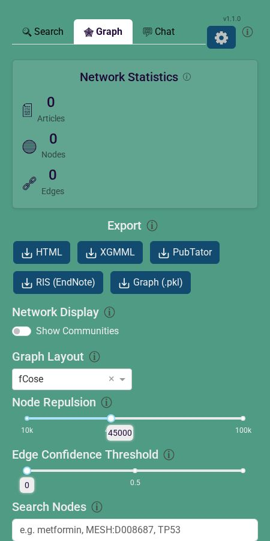
  <br>
  <i>Figure 6: Interactive Knowledge Graph showing Bio-Concept connections.</i>
</p>

<p align="center">
  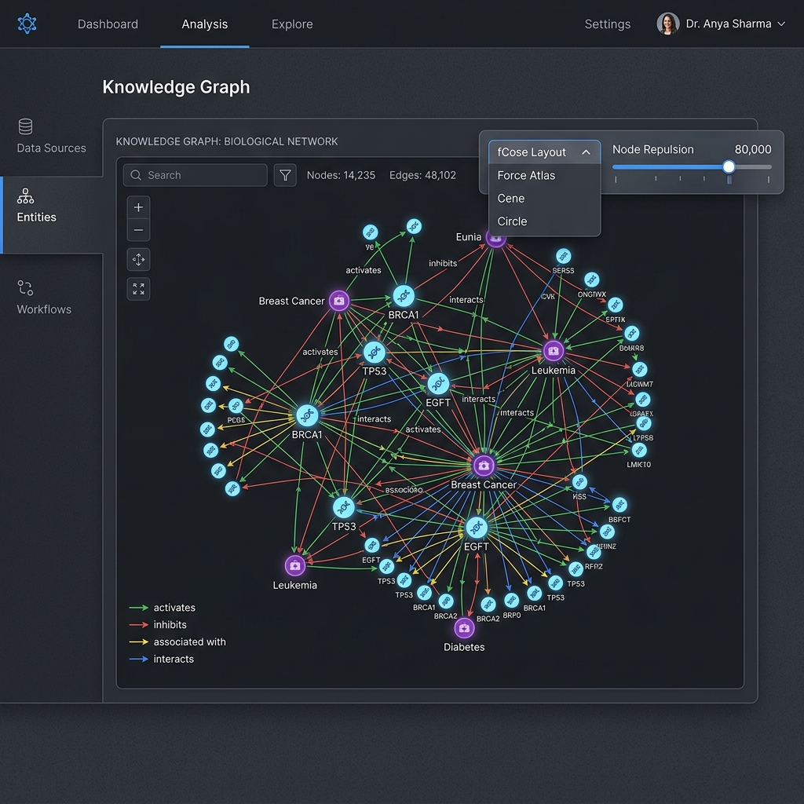
  <br>
  <i>Figure 7: High-resolution view of the Graph Panel interface.</i>There are several options in the top right corner of the graph panel, including layout, community detection, and save. 
</p>

<p align="center">
  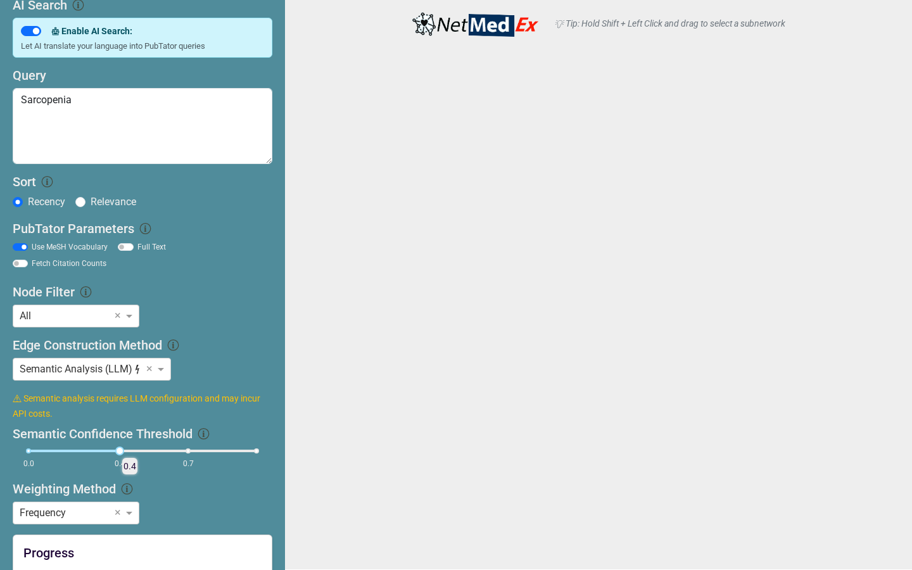
  <br>
  <i>Figure 8: Case study: Visualizing the Sarcopenia-related network using NetMedEx to depict the relationships in semantic level between genes, diseases, chemicals, and species.</i>
</p>

- **Nodes**: Genes, Diseases, Chemicals, and Species.
- **Edges**: Literature co-occurrence. Thicker edges indicate higher frequency.
- **Clusters**: Use the **Community Detection** feature to group related concepts automatically.

<p align="center">
  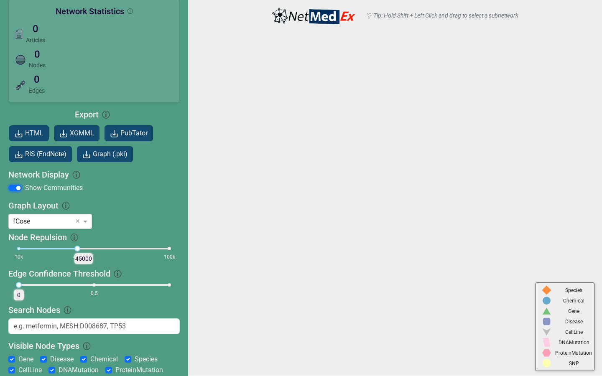
  <br>
  <i>Figure 9: Automated community detection for functional clustering.</i>
</p>

<p align="center">
  
  <br>
  <i>Figure 10: Selecting a sub-network by holding the Shift key to isolate relevant nodes and edges as the base for hybridRAG to chat with.</i>
</p>


### 3. Chat & Semantic Insights (Interpretation)
The **Chat Panel** provides the deep semantic layer, interpreting the graph using LLMs.

<p align="center">
  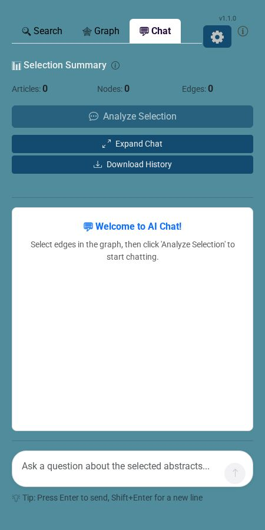
  <br>
  <i>Figure 11: Hybrid RAG Chat for natural language reasoning over the network.</i>
</p>

<p align="center">
  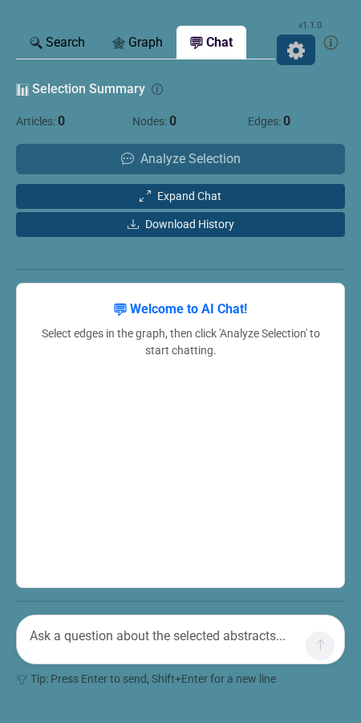
  <br>
  <i>Figure 12(A): Press the "Analyze Selection" button to construct RAGs for communications with the selected sub-network.</i>
</p>

<p align="center">
  
  <br>
  <i>Figure 12(B): RAG generating to prepare the chat later.</i>
</p>

<p align="center">
  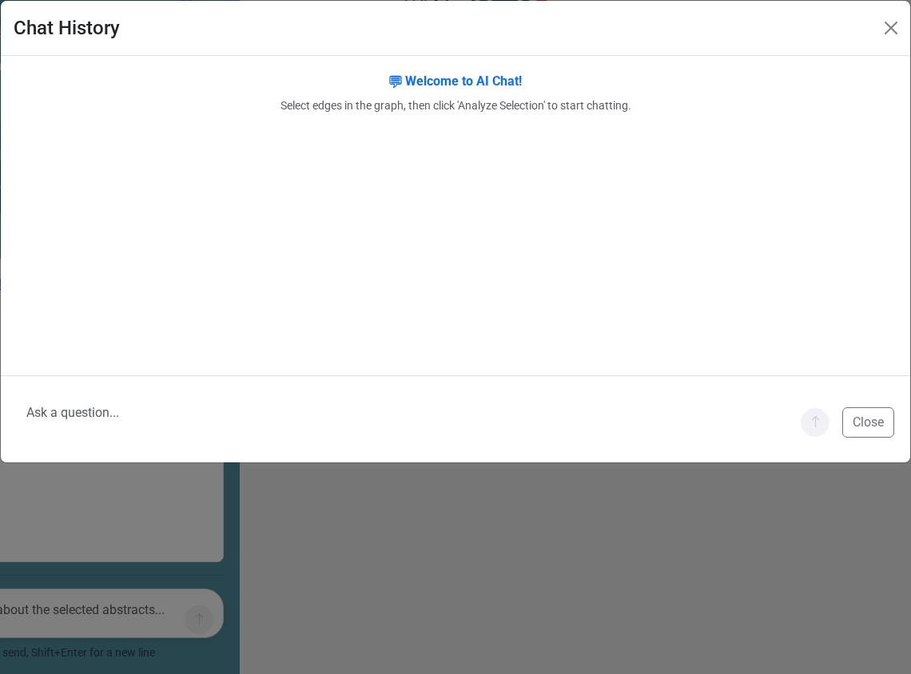
  <br>
  <i>Figure 13: The Chat History panel for managing and reviewing previous discovery sessions.</i>
</p>

<p align="center">
  
  <br>
  <i>Figure 14: Tabular representation of semantic analysis results (e.g., miRNA relationships).</i>
</p>


## ⚙️ Batch Processing vs. Interactive Discovery

While the **Web Interface** provides a full "Interactive Discovery" workflow—including dynamic sub-network selection (Shift+Select) and real-time Hybrid RAG chat—the **CLI** and **API** are designed for automated batch processing and static graph construction. 

- **Interactive Discovery (Web Only)**: Real-time interaction, dynamic graph filtering, and context-aware chat.
- **Batch Processing (CLI/API)**: Static semantic analysis and high-throughput network generation.

---

## 🛠️ Command-Line Interface (CLI)

For high-throughput analysis, use the NetMedEx CLI.

#### Step 1: Search PubMed
```bash
# Search articles by keywords
netmedex search -q '"N-dimethylnitrosamine" AND "Metformin"' --sort score
```

`netmedex search` key options:
- `-q, --query`: Query string.
- `-p, --pmids`: Comma-separated PMID list (alternative to `--query`).
- `-f, --pmid_file`: Load PMIDs from file, one per line (alternative to `--query`).
- `-o, --output`: Output `.pubtator` path.
- `-s, --sort {score,date}`: Sort by relevance (`score`) or newest (`date`, default).
- `--max_articles`: Maximum number of articles to request (default: `1000`).
- `--full_text`: Collect full-text annotations when available.
- `--use_mesh`: Use MeSH vocabulary in output.
- `--ai_search`: Enable LLM-based natural language to PubTator boolean query translation.
- `--llm_provider {openai,google,local}`: Provider for AI search translation.
- `--llm_api_key`: API key override for selected provider.
- `--llm_model`: Model override for selected provider.
- `--llm_base_url`: Base URL override (primarily for local/OpenAI-compatible endpoints).

Optional: enable AI query translation (`--ai_search`) with the same three providers.

```bash
# OpenAI
netmedex search \
  -q "Find papers about metformin effects in NASH" \
  --ai_search \
  --llm_provider openai \
  --llm_api_key "$OPENAI_API_KEY" \
  --llm_model "gpt-4o-mini"
```

```bash
# Google / Gemini
netmedex search \
  -q "Find papers about metformin effects in NASH" \
  --ai_search \
  --llm_provider google \
  --llm_api_key "$GEMINI_API_KEY" \
  --llm_model "gemini-2.0-flash"
```

```bash
# Local (Ollama / LocalAI / LM Studio OpenAI-compatible endpoint)
netmedex search \
  -q "Find papers about metformin effects in NASH" \
  --ai_search \
  --llm_provider local \
  --llm_base_url "http://localhost:11434/v1" \
  --llm_model "llama3.1"
```

#### Step 2: Build the Network
```bash
# Generate HTML network from annotations
netmedex network -i annotations.pubtator -o network.html -w 2 --community

# Generate pickle graph for CLI chat (required for `netmedex chat`)
netmedex network -i annotations.pubtator -o network.pickle -f pickle
```

#### Step 3 (Optional): Semantic Edge Extraction with LLM Providers
Use `--edge_method semantic` to enable semantic relationship extraction.

```bash
# OpenAI
netmedex network \
  -i annotations.pubtator \
  -o semantic_openai.html \
  --edge_method semantic \
  --llm_provider openai \
  --llm_api_key "$OPENAI_API_KEY" \
  --llm_model "gpt-4o-mini"
```

```bash
# Google / Gemini
netmedex network \
  -i annotations.pubtator \
  -o semantic_google.html \
  --edge_method semantic \
  --llm_provider google \
  --llm_api_key "$GEMINI_API_KEY" \
  --llm_model "gemini-2.0-flash"
```

```bash
# Local (Ollama / LocalAI / LM Studio OpenAI-compatible endpoint)
netmedex network \
  -i annotations.pubtator \
  -o semantic_local.html \
  --edge_method semantic \
  --llm_provider local \
  --llm_base_url "http://localhost:11434/v1" \
  --llm_model "llama3.1"
```

You can also omit `--llm_*` flags and configure defaults via `.env` (e.g., `LLM_PROVIDER`, `OPENAI_API_KEY`, `GEMINI_API_KEY`, `LOCAL_LLM_BASE_URL`, `OPENAI_MODEL`, `GOOGLE_MODEL`, `LOCAL_LLM_MODEL`).

Provider consistency note:
- CLI now supports the same three providers (`openai`, `google`, `local`) across `search`, `network`, and `chat`.
- Provider settings are passed by CLI flags or `.env` values; they are not serialized into `.pubtator`/graph outputs automatically.

#### Step 4 (Optional): Hybrid RAG CLI Chat (Search → Network → Chat)
`netmedex chat` uses the pickled graph (`-f pickle`) as Hybrid RAG context and supports the same three providers.

```bash
# One-shot question
netmedex chat \
  -g network.pickle \
  -q "Summarize key evidence and hypotheses for metformin in NASH." \
  --llm_provider openai \
  --llm_api_key "$OPENAI_API_KEY"
```

```bash
# Interactive mode
netmedex chat \
  -g network.pickle \
  --llm_provider local \
  --llm_base_url "http://localhost:11434/v1" \
  --llm_model "llama3.1"
```

Tips:
- Type `exit` or `quit` to leave interactive mode.
- Use `/clear` to clear chat history.
- Use `/stats` to inspect session statistics.

---

## 🐍 Package API

NetMedEx can be integrated directly into your Python pipelines as a library.

```python
# Programmatic Access (API)
from netmedex import search, network
```

### Embed NetMedEx in Your Own Chat App

If your upstream pipeline finds candidate genes (e.g., top 5 DE genes), you can directly bridge into NetMedEx and keep a conversational session in your own UI.

See example:
- `examples/netmedex_chat_bridge.py`

Minimal flow:
```python
from netmedex.chat_bridge import BridgeConfig, NetMedExChatBridge

cfg = BridgeConfig(provider="google", model="gemini-2.0-flash", edge_method="semantic")
bridge = NetMedExChatBridge(cfg)

bridge.build_context_from_genes(
    genes=["SOST", "LRP5", "TNFRSF11B", "RUNX2", "ALPL"],
    disease="osteoporosis",
)
answer = bridge.ask("What are the strongest evidence links and possible mechanisms?")
print(answer["message"])
```

### FastAPI Bridge (for external chat UIs)

Install API extras and run:
```bash
pip install -e ".[api]"
python examples/netmedex_fastapi_server.py
```

Endpoints:
- `GET /health`: service health check.
- `POST /sessions`: build Search -> Network -> Chat context and create a chat session.
- `POST /sessions/{session_id}/ask`: send a question in that session.
- `DELETE /sessions/{session_id}`: release session state.

Create a session from genes:
```bash
curl -X POST "http://127.0.0.1:8000/sessions" \
  -H "Content-Type: application/json" \
  -d '{
    "config": {
      "provider": "google",
      "model": "gemini-2.0-flash",
      "edge_method": "semantic",
      "max_articles": 120
    },
    "genes": ["SOST", "LRP5", "TNFRSF11B", "RUNX2", "ALPL"],
    "disease": "osteoporosis"
  }'
```

Ask in-session:
```bash
curl -X POST "http://127.0.0.1:8000/sessions/<SESSION_ID>/ask" \
  -H "Content-Type: application/json" \
  -d '{"question":"Summarize strongest evidence and potential mechanisms."}'
```

Framework-agnostic Python client example:
```python
from examples.netmedex_fastapi_client import NetMedExAPIClient

client = NetMedExAPIClient("http://127.0.0.1:8000")
client.create_session(
    config={
        "provider": "google",
        "model": "gemini-2.0-flash",
        "edge_method": "semantic",
        "max_articles": 120,
    },
    genes=["SOST", "LRP5", "TNFRSF11B", "RUNX2", "ALPL"],
    disease="osteoporosis",
)
resp = client.ask("Summarize strongest evidence and potential mechanisms.")
print(resp["message"])
client.close()
```

Reference client file:
- `examples/netmedex_fastapi_client.py`

Integration examples for your own app/chat platform:

```python
# Example A: wrap NetMedEx into your backend service function
from examples.netmedex_fastapi_client import NetMedExAPIClient

def run_gene_chat(genes: list[str], user_question: str) -> str:
    client = NetMedExAPIClient("http://127.0.0.1:8000")
    client.create_session(
        config={
            "provider": "google",
            "model": "gemini-2.0-flash",
            "edge_method": "semantic",
            "max_articles": 120,
        },
        genes=genes,
        disease="osteoporosis",
    )
    try:
        resp = client.ask(user_question)
        return resp.get("message", "")
    finally:
        client.close()
```

```javascript
// Example B: call NetMedEx API from any web frontend (React/Vue/plain JS)
async function askNetMedEx(baseUrl, sessionId, question) {
  const resp = await fetch(`${baseUrl}/sessions/${sessionId}/ask`, {
    method: "POST",
    headers: { "Content-Type": "application/json" },
    body: JSON.stringify({ question })
  });
  if (!resp.ok) throw new Error(await resp.text());
  return await resp.json(); // { success, message, sources, ... }
}
```

```text
Example C: recommended lifecycle for multi-turn chat
1) User selects genes/disease in your app.
2) Backend calls POST /sessions once and stores session_id.
3) Each user message calls POST /sessions/{session_id}/ask.
4) On chat end/timeout, call DELETE /sessions/{session_id}.
```

Minimal Web Chat UI (no framework):
```bash
# terminal 1: start FastAPI bridge
python examples/netmedex_fastapi_server.py

# terminal 2: serve static examples folder
python -m http.server 8080 --directory examples
```

Then open:
- `http://127.0.0.1:8080/minimal_chat_ui.html`

Gradio Chat UI:
```bash
# terminal 1: start FastAPI bridge
python examples/netmedex_fastapi_server.py

# terminal 2: launch gradio app
pip install -e ".[ui]"
python examples/gradio_chat_ui.py
```

Then open:
- `http://127.0.0.1:7860`
- In the UI, click `Create Session` first, then ask questions.

---
© 2026 LSBNB Lab@ IIS, Academia Sinica, TAIWAN. Refer to [LICENSE](LICENSE) for details.
